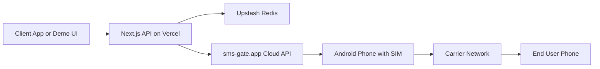
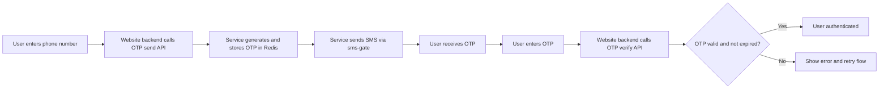

# SMS OTP Service

A lightweight self-hosted OTP microservice built with Next.js App Router, Upstash Redis, and sms-gate.app.

It is designed for:
- Fast OTP send/verify APIs for web/mobile apps
- Serverless deployment on Vercel free tier
- Demo UI for manual testing

## What This Service Does

1. Generates secure 6-digit OTPs
2. Hashes OTPs with SHA-256 before storage
3. Stores OTP state in Upstash Redis with TTL
4. Sends SMS via sms-gate.app (Android relay)
5. Verifies OTP with attempt limiting and expiry

## System Architecture



### Components

- API Layer: Next.js route handlers
- OTP Engine: generate/hash/verify logic
- State Store: Upstash Redis keys with TTL
- Delivery Layer: sms-gate.app + Android relay device
- UI Layer:
  - Landing page: / 
  - Demo flow: /demo

## End-to-End Workflow



Main steps:
- Send OTP request from your backend
- Store hashed OTP with TTL and limits
- Deliver OTP over SMS
- Verify OTP from your backend
- Authenticate user on success

## Project Structure

```text
SMS_Service/
├── app/
│   ├── api/
│   │   ├── otp/
│   │   │   ├── send/route.ts
│   │   │   └── verify/route.ts
│   │   └── health/route.ts
│   ├── demo/page.tsx
│   ├── globals.css
│   ├── layout.tsx
│   └── page.tsx
├── components/
│   ├── PhoneInput.tsx
│   └── OtpInput.tsx
├── lib/
│   ├── auth.ts
│   ├── otp.ts
│   ├── redis.ts
│   └── sms.ts
├── public/
├── .env.example
├── .env.local
├── next.config.ts
├── package.json
└── tsconfig.json
```

## Environment Variables

Copy .env.example to .env.local and set values.

| Variable | Required | Purpose |
|---|---|---|
| UPSTASH_REDIS_REST_URL | Yes | Upstash Redis REST URL |
| UPSTASH_REDIS_REST_TOKEN | Yes | Upstash Redis token |
| SMS_GATE_LOGIN | Yes | sms-gate username/login |
| SMS_GATE_PASSWORD | Yes | sms-gate password |
| SMS_GATE_URL | Yes | sms-gate endpoint |
| API_SECRET_KEY | Yes | Secret required by API routes |
| NEXT_PUBLIC_API_SECRET_KEY | Demo only | Used by /demo UI client calls |

Important:
- NEXT_PUBLIC_API_SECRET_KEY is exposed to browser code. Keep it only for demo/testing flows.
- For production apps, call the OTP API from your own backend and keep API_SECRET_KEY server-side only.

## Reuse This Service In Your Own Website (Step-by-Step)

If you want to use this OTP service for your own app, follow this exact flow.

### Step 1: Clone and install

```bash
git clone <your-fork-or-this-repo-url>
cd SMS_Service
npm install
```

### Step 2: Add your own keys

Create `.env.local` from `.env.example` and set your own values:

- Upstash Redis URL and token
- sms-gate login/password/url
- API_SECRET_KEY

Optional (demo only):

- NEXT_PUBLIC_API_SECRET_KEY

Important:

- Never use someone else's secrets.
- Keep `API_SECRET_KEY` private.

### Step 3: Run locally

```bash
npm run dev
```

Test quickly:

- Health check: `GET /api/health`
- Send OTP: `POST /api/otp/send`
- Verify OTP: `POST /api/otp/verify`

### Step 4: Deploy to Vercel

1. Push your copy to GitHub.
2. Import repo in Vercel.
3. Add the same environment variables in Vercel Project Settings.
4. Deploy.

Or deploy from CLI:

```bash
vercel --prod
```

### Step 5: Integrate into your website auth flow

Use server-to-server calls from your website backend (recommended).

Flow:

1. User enters phone number in your app.
2. Your backend calls `POST /api/otp/send`.
3. User enters OTP.
4. Your backend calls `POST /api/otp/verify`.
5. On success, your backend logs user in (session/JWT).

### Step 6: Sample backend calls

Send OTP:

```http
POST /api/otp/send
x-api-key: <API_SECRET_KEY>
Content-Type: application/json

{ "phone": "+918329908401" }
```

Verify OTP:

```http
POST /api/otp/verify
x-api-key: <API_SECRET_KEY>
Content-Type: application/json

{ "phone": "+918329908401", "otp": "123456" }
```

### Step 7: Production best practices

1. Keep `API_SECRET_KEY` only in backend/server env.
2. Do not call `/api/otp/*` directly from browser in production.
3. Rotate keys periodically.
4. Monitor 429 and 500 rates.
5. Keep sms-gate relay Android device online.

## Can This Work For Different Website Architectures?

Yes. It works with most stacks as long as there is a backend layer.

Supported patterns:

- Next.js (API routes/server actions)
- Node/Express/Nest
- Java/Spring
- .NET
- Python/FastAPI/Django
- Mobile apps (Flutter/React Native) via backend

Not recommended directly:

- Pure static frontend only apps that cannot hide secrets

## Current Constraints To Know

1. Phone validation is currently India-specific (`+91` + 10 digits).
2. sms-gate requires your Android relay device to stay online.
3. `NEXT_PUBLIC_API_SECRET_KEY` is for demo convenience only.

## If You Want This To Be Multi-Website Ready (Advanced)

For true shared usage across many products, next improvements are:

1. Multi-tenant client keys (`client_id` + per-client secrets).
2. Per-client rate limits and OTP policies.
3. Optional global phone format support (not only +91).
4. Session-based OTP verification (issue `verificationId` on send).

Star this repo if this was helpful.
