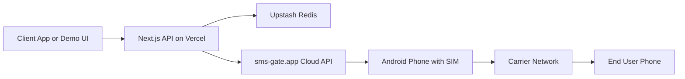
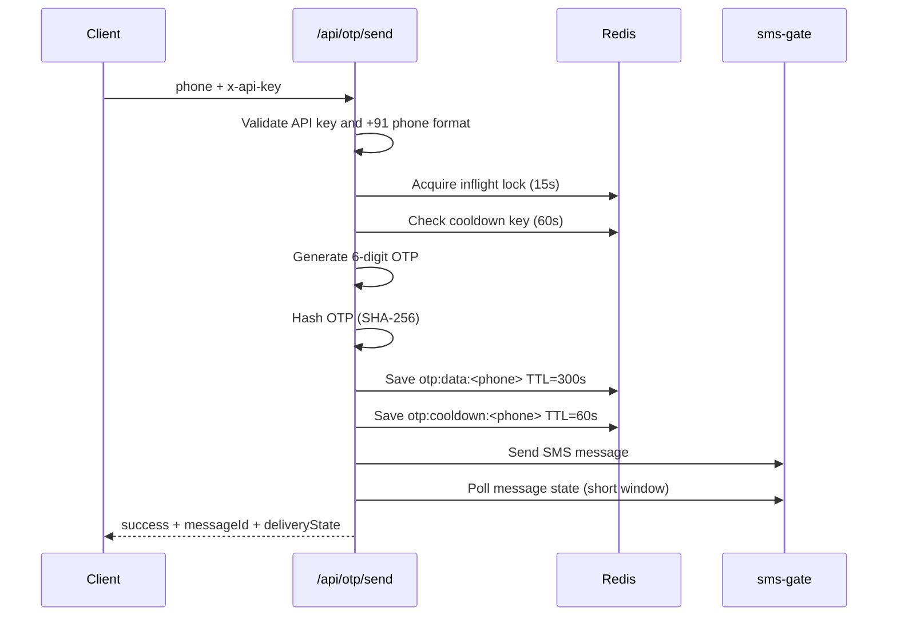
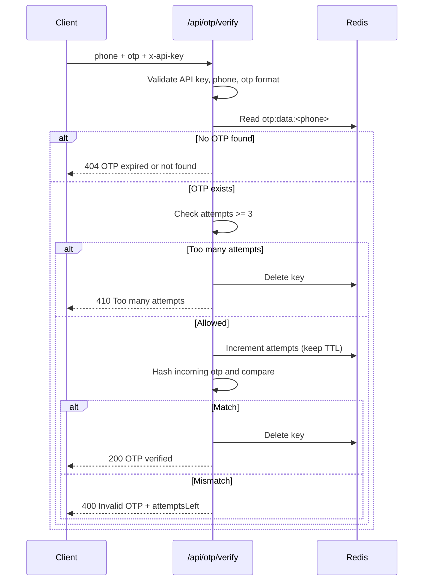

# SMS OTP Service

A lightweight self-hosted OTP microservice built with Next.js App Router, Upstash Redis, and sms-gate.app.

It is designed for:
- Fast OTP send/verify APIs for web/mobile apps
- Serverless deployment on Vercel free tier
- Demo UI for manual testing

## What This Service Does

1. Generates secure 6-digit OTPs
2. Hashes OTPs with SHA-256 before storage
3. Stores OTP state in Upstash Redis with TTL
4. Sends SMS via sms-gate.app (Android relay)
5. Verifies OTP with attempt limiting and expiry

## System Architecture



### Components

- API Layer: Next.js route handlers
- OTP Engine: generate/hash/verify logic
- State Store: Upstash Redis keys with TTL
- Delivery Layer: sms-gate.app + Android relay device
- UI Layer:
  - Landing page: / 
  - Demo flow: /demo

## End-to-End Workflow

### OTP Send Workflow



### OTP Verify Workflow



## Project Structure

```text
SMS_Service/
├── app/
│   ├── api/
│   │   ├── otp/
│   │   │   ├── send/route.ts
│   │   │   └── verify/route.ts
│   │   └── health/route.ts
│   ├── demo/page.tsx
│   ├── globals.css
│   ├── layout.tsx
│   └── page.tsx
├── components/
│   ├── PhoneInput.tsx
│   └── OtpInput.tsx
├── lib/
│   ├── auth.ts
│   ├── otp.ts
│   ├── redis.ts
│   └── sms.ts
├── public/
├── .env.example
├── .env.local
├── next.config.ts
├── package.json
└── tsconfig.json
```

## Environment Variables

Copy .env.example to .env.local and set values.

| Variable | Required | Purpose |
|---|---|---|
| UPSTASH_REDIS_REST_URL | Yes | Upstash Redis REST URL |
| UPSTASH_REDIS_REST_TOKEN | Yes | Upstash Redis token |
| SMS_GATE_LOGIN | Yes | sms-gate username/login |
| SMS_GATE_PASSWORD | Yes | sms-gate password |
| SMS_GATE_URL | Yes | sms-gate endpoint |
| API_SECRET_KEY | Yes | Secret required by API routes |
| NEXT_PUBLIC_API_SECRET_KEY | Demo only | Used by /demo UI client calls |

Important:
- NEXT_PUBLIC_API_SECRET_KEY is exposed to browser code. Keep it only for demo/testing flows.
- For production apps, call the OTP API from your own backend and keep API_SECRET_KEY server-side only.

## API Reference

All error responses follow:

```json
{ "success": false, "message": "..." }
```

All successful responses include:

```json
{ "success": true, ... }
```

### GET /api/health

No auth required.

Response:

```json
{
  "status": "ok",
  "timestamp": "2026-04-17T10:00:00.000Z"
}
```

### POST /api/otp/send

Headers:

```http
x-api-key: <API_SECRET_KEY>
Content-Type: application/json
```

Body:

```json
{ "phone": "+918329908401" }
```

Rules:
- Phone must be +91 followed by 10 digits
- Cooldown window: 60s
- Inflight duplicate lock: 15s
- OTP TTL: 300s

Success (200):

```json
{
  "success": true,
  "message": "OTP sent",
  "messageId": "abc123",
  "deliveryState": "Sent"
}
```

Errors:
- 401 Unauthorized
- 422 Invalid phone number format
- 429 Resend cooldown active (with retryAfter) or request already in progress
- 500 SMS sending failed

### POST /api/otp/verify

Headers:

```http
x-api-key: <API_SECRET_KEY>
Content-Type: application/json
```

Body:

```json
{ "phone": "+918329908401", "otp": "123456" }
```

Rules:
- Phone must be +91 followed by 10 digits
- OTP must be 6 digits
- Max attempts: 3

Success (200):

```json
{ "success": true, "message": "OTP verified" }
```

Errors:
- 400 Invalid OTP (returns attemptsLeft)
- 401 Unauthorized
- 404 OTP expired or not found
- 410 Too many attempts. Request a new OTP.
- 422 Invalid input format

## Demo UI Workflow (/demo)

Screen 1:
- Enter 10-digit mobile number
- Calls /api/otp/send with +91 prefix

Screen 2:
- Enter 6-digit OTP
- Auto-verifies when all digits are filled
- Send again supports cooldown handling
- Handles invalid/expired/too-many-attempt states

Verified state:
- Shows success message and reset action

## Local Development

Install and run:

```bash
npm install
npm run dev
```

Build test:

```bash
npm run build
```

## Deploy to Vercel

1. Push repository to GitHub
2. Import project in Vercel
3. Set all environment variables for Production
4. Deploy

CLI option:

```bash
vercel --prod
```

## Integration Pattern for Existing Websites

Recommended:
1. Frontend calls your own backend
2. Your backend calls this OTP service
3. Keep API_SECRET_KEY on server only

Avoid sending API_SECRET_KEY from browser apps in production.

## Security and Reliability Notes

- OTP values are never stored in plaintext
- Redis TTL enforces expiry automatically
- Attempt limit mitigates brute-force retries
- Cooldown prevents rapid resend abuse
- Inflight lock avoids duplicate OTP generation from concurrent clicks

Operational constraint:
- sms-gate requires the Android relay phone to remain online for message processing.

## Troubleshooting

### 500 SMS sending failed
- Verify SMS_GATE_* variables in deployment environment
- Confirm Android relay device is online and sms-gate app is active
- Check sms-gate status for returned messageId

### 401 Unauthorized
- Wrong/missing x-api-key
- API_SECRET_KEY mismatch between caller and deployment

### 429 Resend cooldown active
- Wait retryAfter seconds before resending

### Demo page not sending OTP
- Ensure NEXT_PUBLIC_API_SECRET_KEY is set
- Ensure /api routes are reachable in same deployment

## License

MIT
